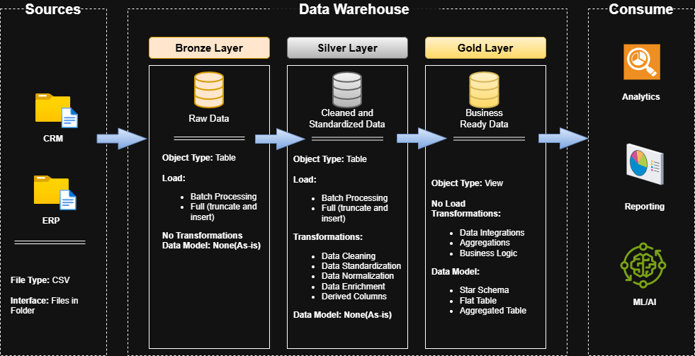

# Data Warehouse Project
Welcome to the **Data Warehouse Project** repository.
This project focuses on building a data warehouse to generate actionable insights. It is a portfolio project designed to demonstrat best practices in data engineering.

## Project Requirements
### Building the Data Warehouse (Data Engineering)
#### Objective
Develop a modern data warehouse using PostgreSQL to consolidate sale data, enabling analytical reporting and informed decision making.

#### Specification
* **Data Scources**: Import data from two source systems (ERP and CRM) provided as csv files.
* **Data Quality**: Cleanse and resolve data quality issues prior to analysis.
* **Integration**: Combine both sources into single, user friendly data model designed for analytical queries.
* **Scope**: Focus on the latest dataset only: historization of data is not required.
* **Documentation**: Provide clear documentation of data model to support both business stakeholders and analytics teams.

## Data Architecture
#### Architecture: **Medallion** Architecture(**Bronze, Silver and Gold layers**)) 
* **Bronze Layers**: This layer stores Raw Data from source system(CSV files).
* **Silver Layers**: This layer stores cleaned and standardized data.
* **Gold Layers**: This layers stores business ready data for reporting and analytics.

